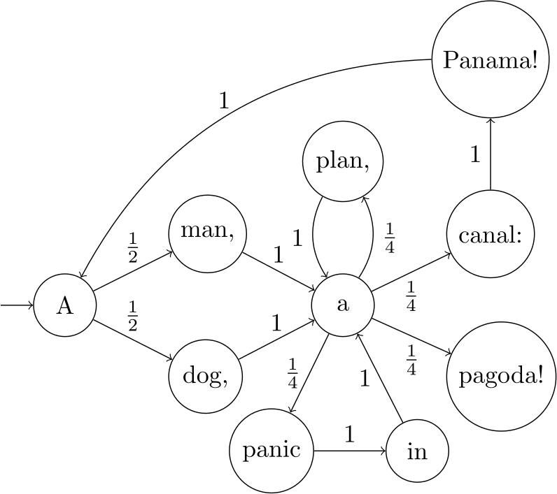
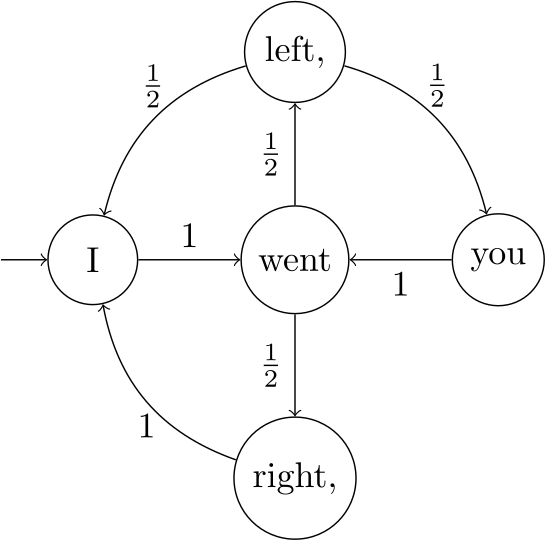
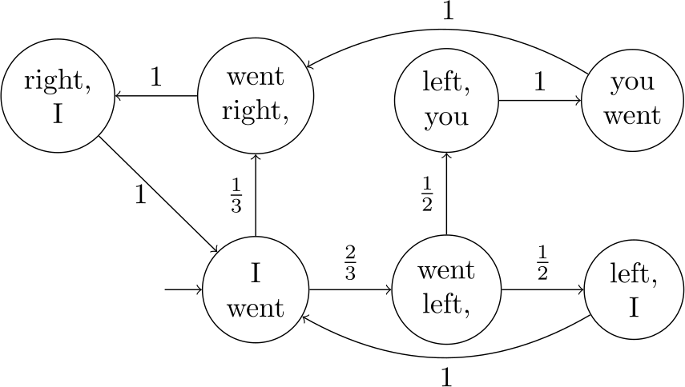

Markov Chains
==

As you probably observed with your stochastic sampler, building up sentences by randomly picking words according to their occurrence probabilities in a corpus doesn't give very convincing results. It's better than picking words randomly out of a dictionary in that rare words stay rare (Zyzzogeta are, alas, rarely mentioned on Twitter), but we're not doing anything to try to make *adjacent* words go well together. For example, suppose we were using the following (very small) corpus:

> *A man, a plan, a canal: Panama! A dog, a panic in a pagoda!*

With the stochastic sampler, the single most likely pair of words to be generated is "a a", a combination that basically never occurs in English. What's going on here is that the word "a" by itself is very common, but *given that the previous word was "a"*, it is very rare. This suggests that we can improve our sentence generator by keeping track of *context* when deciding what word to pick next.

One very popular way to do this is with a mathematical object called a *Markov chain*. A Markov chain consists of a bunch of *states* linked together by *transitions* telling you how likely it is to go from one state to another. We can visualize a Markov chain as a graph, where the vertices are states and the edges are transitions labelled with their probabilities. Here's a Markov chain learned from the corpus above, where each state corresponds to a token:

Can you see where the probabilities came from? The token "a" occurs four times in the corpus, followed once each by "plan,", "canal:", "panic", and "pagoda!". So in the Markov chain, the state *a* has transitions leading to the states for those four tokens, each with probability 1/4.

To generate a sentence with a Markov chain, we perform a *random walk*: starting from some state, we pick a random transition (according to its probability), follow it, and repeat. Doing this we visit a sequence of states, which in our application corresponds to a sequence of tokens. 

> [info]
>
Let's look at a concrete example. Say we start at state *A*. Our first random choice is between states *man* and *dog,*, each with probability 1/2 - say we take *dog,*. Now we don't have any choice, since there's only one transition out of state *dog,*, so we go to state *a*. Next we have four options with probability 1/4: *plan,*, *canal:*, *pagoda!*, and *panic*. Suppose our random choice is *plan,*, whose only outgoing transition sends us back to *a*. We have the same four options, and maybe a roll of the dice puts us in *plan,* again (there's nothing wrong with this - random choices in a Markov chain depend only on which state you're currently in, not which states you've visited in the past). We have to go back to *a*, and this time say we pick *canal:* from the four options. From there our only choice is to go to *Panama!*, which seems like a good place to stop. So our final sentence is "A dog, a plan, a plan, a canal: Panama!". Not very profound, but at least it's grammatical.

Note how different this way of generating sentences is from the old stochastic sampler: the probability distribution we use at each step depends on which state we're at, i.e. which word we last generated. Since the pair of tokens "a a" never occurs in our corpus, the state *a* doesn't have a transition back to itself, and so the probability of generating "a a" is *zero*.

> [action]
>
Now let's try implementing this! You'll need to write code to do two things:
>
1. *Learn a Markov chain from a corpus.* You've already written code to find how often a token appears in a corpus, but now you need to find how often a token appears *after* another token.
>
2. *Do a random walk on a Markov chain.* This should be pretty simple if you pick a good way to store the Markov chain you learn.
>
Make sure to think about what data structures to use to make your code efficient. Both learning the Markov chain and taking a step of the random walk should take time at most linear in the size of the corpus.
>
When you're ready, try your implementation out on a real corpus and see how it compares to the stochastic sampler!

<!-- html comment to break boxes -->

> [info]
>
While writing and testing your random walk implementation you might come up against a couple of points we glossed over above.
>
1. *Where to start?* Obviously you might get different results depending on how you pick a state to start your walk from. Are there some states which particularly make sense in this application? Feel free to try out different possibilities and see how it affects your results!
>
2. *What if I get stuck?* Take a look at the state *pagoda!* in the Markov chain above. Since this corresponds to the last token in the corpus, it doesn't have any outgoing transitions, and so your random walk will get stuck if it enters that state. You could of course just stop there, but what should you do if you want to generate more text? Many options are fine here (as long as your code doesn't crash!), but before doing extensive experiments you may want to think about how often this situation will arise given a large corpus.

Higher Order Markov Chains and n-grams
==

Let's take a look at another tiny corpus:

> *I went left, you went right, I went left, I went right,*

The Markov chain we get looks like this:

By taking context into account, the Markov chain eliminates many nonsensical possibilities: "went left," and "went right," are okay, but "went I" and "went you" have zero probability. However, some patterns in the text are not reflected in the Markov chain. For example, the corpus seems to say that "I" favor going left and "you" favor going right, but in the Markov chain "I went left" and "I went right" are equally likely, as are "you went left" and "you went right". The reason is of course that distinguishing between these requires looking back *two* words, while the Markov chain only keeps track of *one*.

## Second-Order Markov Chains

As you might expect, there's nothing preventing us from keeping track of more context. The Markov chains we've seen so far are called *first-order*, because their transition probabilities are functions only of *one* state: the current one. In a *second-order* Markov chain, the transitions depend not only on the current state, but on the previous one too. Alternatively, you can think of a second-order Markov chain as a first-order one where the states are labelled with *pairs* of tokens, so that a single state has all the information needed to work out the transitions. This perspective lets us view second-order Markov chains as graphs, like before:

In this figure every state is labelled with two tokens: the one on the bottom is the token we have just seen (or generated), and the one above is the token that came before it (we've put them in this order so that reading the labels top-down reflects their order in the corpus).

How are the transition probabilities determined for a second-order Markov chain? It's a similar process to what we saw before. Then, we counted how often every pair of tokens occurred, so that given the current token we could tell how likely another was to follow. Now, we need to count *triples* of tokens: "I went left," occurs twice and "I went right," only once, so the state *I went* should transition to *went left,* with probability 2/3 and to *went right,* with probability 1/3. Take another look at the figure and make sure you understand where the probabilities are coming from.

> [info]
>
It may be confusing that state *I went* leads to *went left,*, which would seem to make us generate the token "went" twice. The point to remember is that now that states are labelled with pairs of tokens, only the second token is the one we output when we enter a state: the first one is there just so that we can "remember" what the previous token was. We need that information, since the whole point of a second-order Markov chain is that the transition probabilities can depend on it. Just like how an ordinary Markov chain let us pick tokens with different probabilities depending on what the last word we generated was (vs. the stochastic sampler that used the same probabilities every time), a second-order Markov chain lets us use different probabilities depending on what the *two* previous words were. So states need to be labelled with two tokens, but we'll only output one.

## To Infinity and Beyond (well not really)

Second-order Markov chains are even better than first-order ones at modeling text because they use more context, but there's no reason to stop there. Unsurprisingly, an *nth-order Markov chain* is just a Markov chain that keeps track of *n* previous tokens. Such a chain gives you a probability distribution for the next token as a function of the tuple of *n* previous words - often called an *n-gram*. So to learn an nth-order Markov chain from a corpus, we have to count how often each n-gram is followed by each token.

> [action]
>
Clearly using higher order Markov chains can give you better results (think of how many words can plausibly follow the 1-gram "my" vs. the 3-gram "I'm debugging my"), but what is the cost? Work out asymptotically how many n-grams there can be in a corpus with *w* distinct tokens, and how much space it could take to store an nth-order Markov chain learned from the corpus.

## Implementation Issues

Let's try to extend your first-order Markov chain implementation to handle higher-order chains. Hopefully, a fair amount of your code will work with only minor changes: like in the second-order case, we can think of an nth-order chain as a first-order chain whose states are labelled by n-tuples. So in particular your random walk code, which just looks up transition probabilities and moves according to them, should still work.

Computing the transition probabilities is more involved, though. Before, you could just sweep through the corpus, updating a mapping (in some appropriate data structure that will remain nameless) from tokens to the frequencies of following tokens. You can still scan through the corpus, but the input to that map is now the tuple of the last *n* tokens seen. A simple way to get that tuple is just to back up *n* tokens and read them in again, but to get you more practice with data structures let's try something else.

What we'd like to do is maintain a list of the previous *n* tokens in order, removing the oldest one when we advance a step and adding the new one we just read. One data structure that would work here is a *queue*, or FIFO (first-in, first-out) buffer. As the names suggest, elements added to a queue have to wait their turn, only being removed when all elements ahead of them have been. Queues typically support the following operations:

- **enqueue** an item (add it to the back of the queue)
- **dequeue** the item at the front of the queue (remove and return it)
- **iterate** over items in the queue, from front to back

> [info]
>
Let's look at an example. We'll write the contents of the queue as a list, although the queue itself might not be implemented as one. When the queue is created, it is empty: `[]`. If we then enqueue `0`, `1`, and `2`, the queue will be `[0, 1, 2]`. Doing a dequeue, the first element that was enqueued will be removed, yielding `[1, 2]`. Finally, enqueuing `3` gives us `[1, 2, 3]`.

<!-- html comment to break boxes -->

> [action]
>
Implement a queue supporting the operations above. Enqueuing and dequeing should take constant time, and iteration should take constant time per item. Make sure your implementation works correctly if someone tries to dequeue an item from an empty queue: it should throw an exception that explains the problem.

<!-- html comment to break boxes -->

> [info]
>
Ordinary queues don't place restrictions on how many items they can store - they can grow or shrink as needed. However, notice that in the case of Markov chains, we know ahead of time that we'll never need to store more than *n* items in the queue. This means we can use a simpler data structure called a *circular buffer* (or *ring buffer*). Circular buffers are created with a fixed size - once they fill up, any further additions will overwrite values in the buffer, starting with the oldest. If you're interested, try implementing a circular buffer without using linked lists.

<!-- html comment to break boxes -->

> [action]
>
Using your queue implementation, extend your Markov chain learner and sentence generator to use nth-order chains. Try different values of *n* and see how the quality of your generated sentences changes. Also experiment to see how *n* affects the runtime and memory consumption of your code - are your observations in line with the asymptotic analysis you did above?

Where to Go from Here
==

Finished early? Then enjoy another helping of data structure challenges.

Think queues are cool? Try implementing a *deque* (pronounced deck): a double-ended queue where elements can be added and removed from either end in constant time.

If that bores you, here's a classic interview question: how can you implement a doubly-linked list with only one field per node? (And no, you can't assume some extra-wide field that you can cram two pointers into; you only have space to store one pointer.) Your implementation needs to support constant-time adding and removing elements on either end of the list, and linear-time iteration from the front to the back and vice versa, but you don't need to support modifications to the middle of the list.

Lastly, a peek at coming attractions: the *priority queue*. This is a queue where you don't remove elements in order of insertion into the queue, but in order of a numerical *priority* given to each element. What's more, you can *change* the priority of an element after you put it into the queue! Priority queues are a fundamental data structure used in a huge number of algorithms, from sorting arrays to finding shortest paths in graphs. See if you can come up with a few ways to implement one.
