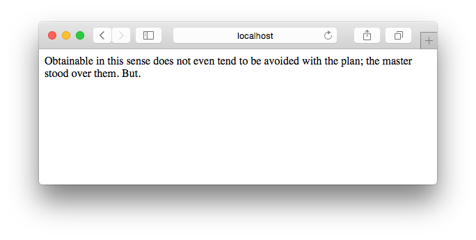
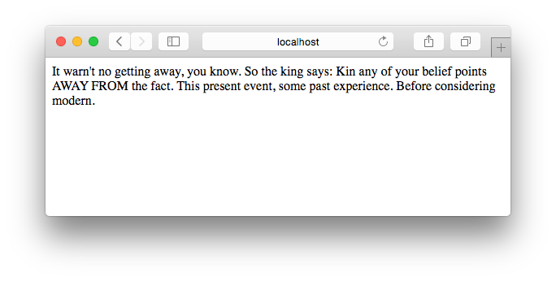
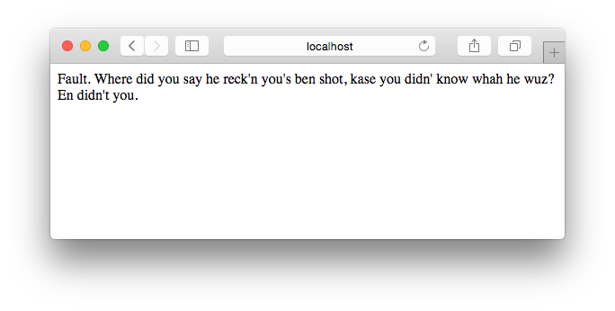

By this point, we've built a working program. Which is great. But wouldn't it be better if the whole world could use it, instead of just us?

Yes. Yes it would.
Let's put it on the web.

In this tutorial, we're going to use the [Flask](http://flask.pocoo.org/) micro-framework to make a small web application where the generated text can be displayed. Eventually, we'll even use this web application to connect with the Twitter API and tweet out the best generated quotes.

If you're unfamiliar with Flask, that's great, you'll be able to pick it up quickly. There are [lots](http://blog.miguelgrinberg.com/post/the-flask-mega-tutorial-part-i-hello-world) [of](https://realpython.com/blog/python/flask-by-example-part-1-project-setup/) [resources](https://exploreflask.com/) to get you up and running quickly. For the purposes of this tutorial, you'll need to learn only the basics of Flask. If you want to learn more (to make your app even better), by all means go ahead and do so.

The goal for this tutorial is to create a web app with an index or home route (`/`) that displays a freshly-generated quote with each page load. We'll develop this web application locally first, and then publish to Heroku later so that anyone on the web can see it.

Local Development
==
Let's get a local version of our web app running.

The first step is to download and install the Flask library: [instructions](http://flask.pocoo.org/docs/0.10/installation/). Note: if you're using Python 3 (and we hope you are), you'll want to install with the `pip3` command, not the `pip` command.

	$ pip3 install Flask

Next you want to create a new script file that will be responsible for starting your web server. By convention this file is called `app.py`, but you can call it `server.py` or whatever you like.

	$ touch app.py

Start by following the instructions in the [Flask quickstart](http://flask.pocoo.org/docs/0.10/quickstart/) to build the most basic Flask app. Once you get it running, you should be able to open a browser and view your app at http://127.0.0.1:5000/ (read as "port 5000 on host 127.0.0.1").

	$ python app.py
	* Running on http://127.0.0.1:5000/ (Press CTRL+C to quit)
	* Restarting with stat
	...

Now you'll see that you have a working web app that displays some basic text on a page. It should be fairly obvious what we'd have to change so that each page visit displays our *generated text* instead of a hard-coded string.

If you've structured your sentence-generating program as a *module*, then you should be able to import the module and use the appropriate function(s) within your Flask route function.

Once you've done that, on each page visit you'll see a new generated quote, like this (from a bot using Huck Finn as its corpus:

It doesn't look super pretty, but we can clean that up later. At least it works!

If you aren't able to get it working, and you're confused because you aren't getting error messages, make sure to enable [debug mode](http://flask.pocoo.org/docs/0.10/quickstart/#debug-mode) for your Flask app.

Push to Heroku
==
Now that we've got a working development version of our app, it's time to put it on the world wide web. We're going to use [Heroku](https://www.heroku.com/), a popular PaaS, or Platform-as-a-Service, to host our deployed web app.

Luckily for us, Heroku has a great guide on getting started with Python apps. Follow this guide to prepare and deploy your app. You don't need to follow all of the steps. The most essential pieces you'll need are:

- A local [Git](https://git-scm.com/) repository for your source code
- A [Heroku account](https://signup.heroku.com/www-home-top)
- [Heroku Toolbelt](https://toolbelt.heroku.com/) installed
- A [Procfile](https://devcenter.heroku.com/articles/procfile) with a `web` process type defined
- A list of [package dependencies defined](https://devcenter.heroku.com/articles/getting-started-with-python#declare-app-dependencies)
- A [specified Python runtime](https://devcenter.heroku.com/articles/python-runtimes)

Once you have all the pieces in place, publishing your app to Heroku is a single command:

	$ git push heroku master

Now all your hard work is viewable, on the internet, all the time, for anyone! Rejoice!

Help! It's Not Working and I Don't Know Why
==
You may run into errors along the way. It doesn't always work smoothly the first time.

That's fine, no problem. Stay calm, read the error message, and [check your Heroku logs](https://devcenter.heroku.com/articles/getting-started-with-python#view-logs).

Google error messages. Ask for help. We're going to get through this.

Some issues to be aware of:
- Heroku expects you to use [virtualenv](https://virtualenv.pypa.io/en/latest/) to manage dependencies with virtual environments
- Heroku expects you to use [foreman](http://ddollar.github.io/foreman/) to start your app (it should be installed automatically with the Heroku Toolbelt)
- Heroku prefers that you use the [Gunicorn HTTP server](http://gunicorn.org/)
- But when you use Gunicorn locally, your Python errors will be "swallowed" (i.e. not displayed in the error page or server log). This [StackOverflow post](http://stackoverflow.com/questions/8950674/debugging-a-flask-app-running-in-gunicorn) covers the issue well, and how to ensure that you can still see errors in development.

Where to Go From Here
==
All finished, with clean and readable code? No? Ok, go do that first. Then, make your web app look better and/or add more features.

- Improve the style of your page (use a nice font, make it bigger, center it, etc.) with CSS
- Display more than one generated quote on the page
- Use a query string to generate the quote (or multiple quotes) with a different n-gram size. For example, visiting `/?ngram=4` would generate text with a 4-word n-gram.
- Add a button to display a new quote (i.e. refresh the page)
- Make a "favorite" button and a `/favorites` route to display all the quotes that have been "favorited" by users. This is advanced stuff: you'll need to use a database. Not for the faint of heart.
